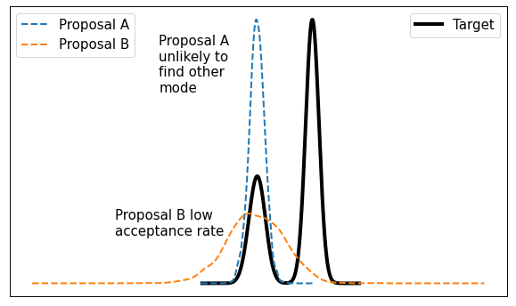

```{r include = FALSE}
library(maths.club)
```

## Motvation

The Metropolis algorithm is as follows. If we are targeting a probability density `p(x)` and we have a function `f(x)` proportional to `p(x)` given a proposal distribution `g(x)` algorithm is as follows:

1. Initialise state by picking a random `x`
1. Propose a new state `y` according to some proposal distribution `g(y)`
1. Accept new state y with uniform probability according to acceptance ratio (this in the case that we have a symmetric proposal density `g`)
   ```
   min(1, f(y) / f(x))
   ```
   If accepted transition to state `y`, otherwise stay in state `x`.
1. Save current state as a sample, repeat 2 & 3

To make the convergence efficient you want your proposal distribution to accept with a high probability, otherwise you get stuck in the state and it takes a very long time for the algorithm to converge.

Note on Metropolis vs Metropolis-Hastings. Metropolis algorithm is a special case of the general Metropolis-Hastings algorithm. The main difference is that the Metropolis-Hastings algorithm does not have the symmetric distribution requirement. In a Metropolis-Hastings algorithm you need to make an adjustment to the acceptance ratio to be

$$
A(y|x) = min\left(1, \frac{f(y)g(x|y)}{f(x)g(y|x)}\right)
$$
If $g$ is symmetric then $g(x|y) = g(y|x)$.

### Example

Imagine a function like

```{r}
f <- function(x) {
  exp(-(x^2)) * 0.5 + exp(-((x - 1)^2)) * 0.3 + exp(-((x + 2)^2)) * 0.2
}

maths.club:::plot_f(f, -5, 5)
```

which we want to find the shape of via sampling.

```{r}
points <- metropolis(f, 0, 1000, 0.3)
maths.club:::plot_both(points, f, -5, 5)
```
 
 If our proposal density is accepted with low probability then we'll see we get stuck in the same state


```{r}
points <- metropolis(f, 0, 1000, 20)
maths.club:::plot_both(points, f, -5, 5)
```

we have poor mixing, and it would take a long time for the algorithm to converge.

But say we have a target with 2 distinct peaks if we pick a proposal distribution which is too narrow, then this is unlikely to find the other mode. There can always be this trade off between the two.



But maybe using HMC can give us a higher acceptance rate?

## Newtonian, Langrangian & Hamiltonian mechanics

Newtonian mechanics is based on application of Newton's laws of motion that describe the relationship between the motion of an object and the forces acting on it.

For example in Newtonian mechanics the motion of a particle is described using Newton's second law, it states that the force $F$ acting on an object is equal to the mass $m$ multiplied by its acceleration $a$.

$$
F = ma
$$

TODO: This is a bad example! We need an example of a closed system for Hamiltonian
For a particle moving under gravity, the force can be written as $F=-mg$ where $g$ is the acceleration due to gravity $9.81m/s^2$ which (recalling that acceleration is $\frac{d^2s}{dt^2}$ gives a second-order differential equation.
$$
ma = -mg \\
\Rightarrow a = -g \\
\Rightarrow \frac{d^2s}{dt^2} = -g
$$
And so we solve this to get the position of a particle after time $t$

$$
s = \int\left(\int-g dt\right)dt\\
  = -\frac{gt^2}{2} + c_1t + c_2
$$

Forces are just possible model to describe motion and dynamics. We can instead describe motion by using the kinetic and potential energy of an object to predict where it will move next.

Hamiltonian mechanics the system is described using the Hamiltonian function $H(q,p)$ which represents the total energy of the system, where $q$ is position and $p$ is momentum. For a particle moving under gravity that is the sum of its kinetic energy $T$ and potential energy $V$

$$
H(q,p) = T(q,p) + V(q)
$$
For this case kinetic energy is given by $T(p) = \frac{p^2}{2m}$ and the potential energy is given by $V(q)=mgh$ where $h$ is the height of the particle above a reference point.

Hamiltons equations of motion are

$$
\frac{dq}{dt} = \frac{\partial H}{\partial p}\\
\frac{dp}{dt} = -\frac{\partial H}{\partial q}
$$

Which we can use to derive

$$
\frac{dq}{dt} = \frac{p}{m}\\
\frac{dp}{dt} = 0
$$
You can then solve to give

$$
q = \frac{pt}{m} + c_1\\
p = -mgt + c_2\\

\Rightarrow q = 
$$


## Hamiltonian Monte-Carlo

Hamiltonian mechanics describes a mechanical system with 2 variables position `q` and momentum `p`.

The phase space is a coordinate system which is defined in terms of position and momentum So when we explore trajectories in phase space, we explore contours of energy, that is the phase. Hamiltonian Monte-Carlo is an MCMC strategy in which the change of accepting a particle (sample) is high, by defining the acceptance criteria in  terms of the total energy on these paths.

The Hamiltonian is defined as follows

$$
H(q,p) = \sum_{i=1}^{d}\dot{q}_{i}p_{i} - L(q, \dot{q}(q,p))
$$
where $d$ is the system dimensions, and $\dot{q}$ refers to the derivative with respect to time, i.e. $\dot{q} = \frac{dq}{dt}$

Algorithm is as follows
1. Draw a new value of `p` from zero mean Gaussian.
1. Starting in state $(p,q)$, run Hamiltonian dynaics for $L$ steps with step size $\epsilon$ using the Leapfrog method. $L$ and $\epsilon$ are hyperparameters of the algorithm. This simulates the particle moving.
1. After running $L$ steps, negative the momentum variables, giving a proposed state of $(q^{*},p^{*})$. The negation makes the proposal distribution system symmetric, i.e. if we run $L$ steps again, we get back to the original state. The negation is necessary for MCMC proof, but is unimportant because we square the momentum before using it in the Hamiltonian.
1. The proposed state $(q^{*},p^{*})$ is accepted as the next state using a Metropolis-Hastings update with probability
$$
A(q^{*},p^{*}) = min(1, exp(-U(q^{*}) + U(q) - K(p^{*}) + K(p)))
$$

It generally converges faster than a random walk based MH algorithm. But has some assumptions. We can only sample from continuous distributions because otherwise our Hamiltonian dynamics could not operate. And we need to be able to compute the partial derivative of the log density to compute Hamilton's equations. 


## Links
[Interactive plots](https://github.com/chi-feng/mcmc-demo)
[Maths behind Hamiltonian MC](https://bjlkeng.io/posts/hamiltonian-monte-carlo/)
[this also looks good but is massive](https://arxiv.org/pdf/1701.02434.pdf)

